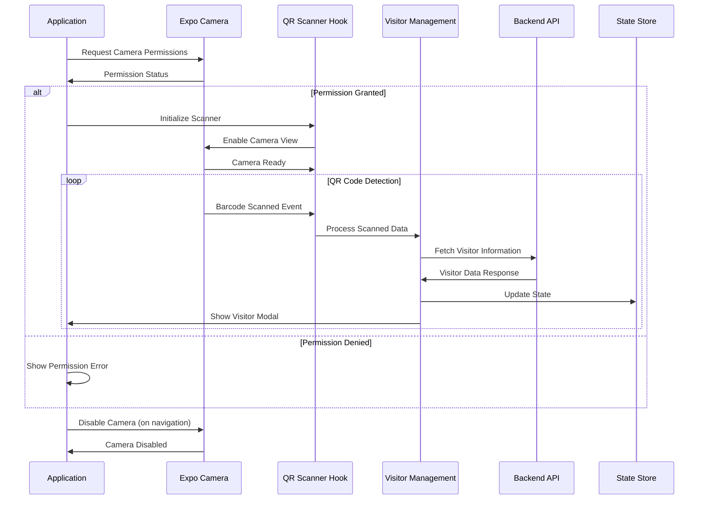
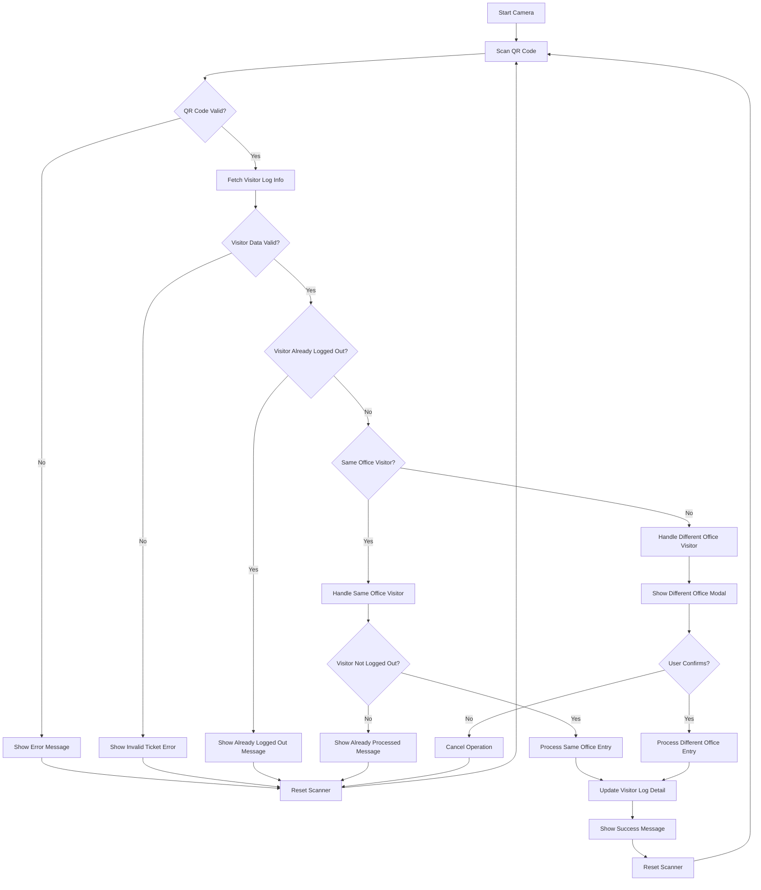
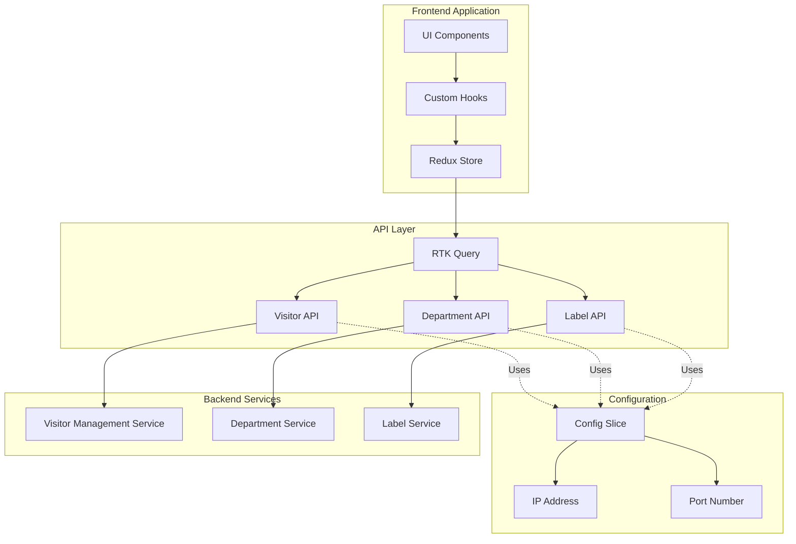
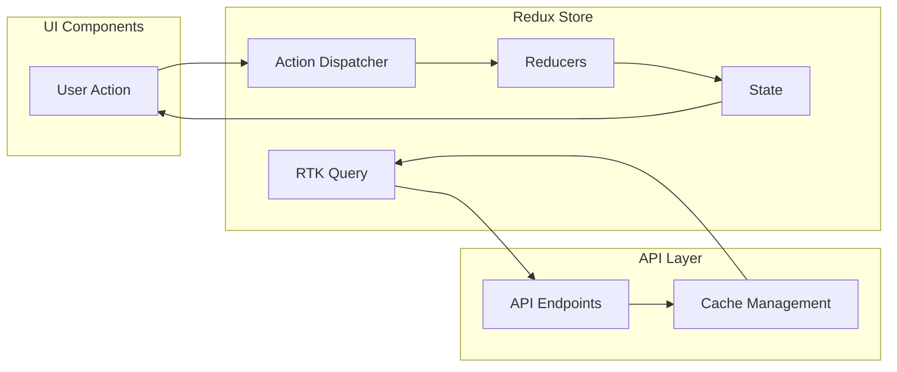

# VMS Department Kiosk - Technical Documentation

## Table of Contents
1. [Overview](#overview)
2. [Architecture](#architecture)
3. [Camera Integration](#camera-integration)
4. [QR Code Scanning Flow](#qr-code-scanning-flow)
5. [API Architecture](#api-architecture)
6. [State Management](#state-management)
7. [Development Setup](#development-setup)
8. [Deployment](#deployment)

## Overview

The VMS Department Kiosk is a React Native application built with Expo that provides visitor management functionality through QR code scanning and manual entry. The application supports both user and visitor modes with different workflows for each.

### Key Features
- **QR Code Scanning**: Real-time camera integration for scanning visitor tickets
- **Manual Entry**: Alternative input method for visitor management
- **Multi-mode Support**: Separate workflows for users and visitors
- **Department Management**: Integration with department-specific workflows
- **Developer Settings**: Configuration management for server endpoints

### Technology Stack
- **Framework**: React Native with Expo
- **Language**: TypeScript
- **State Management**: Redux Toolkit with RTK Query
- **Styling**: NativeWind (Tailwind CSS for React Native)
- **Navigation**: Expo Router
- **Camera**: Expo Camera
- **UI Components**: Custom components with React Native

## Architecture

The application follows a feature-based architecture with clear separation of concerns:

```
VMS-DEPARTMENT-KIOSK/
├── app/                    # Expo Router pages
│   ├── (developer)/       # Developer settings
│   ├── (main)/           # Main dashboard
│   ├── (user)/           # User mode screens
│   └── (visitor)/        # Visitor mode screens
├── components/            # Shared components
├── feature/              # Feature-based modules
│   ├── department/       # Department management
│   ├── user/            # User mode features
│   ├── visitor/         # Visitor mode features
│   └── main/            # Main dashboard features
├── lib/                  # Core utilities
│   ├── redux/           # State management
│   └── utils/           # Utility functions
└── assets/              # Static assets
```

## Camera Integration

The camera integration is built using Expo Camera with custom hooks for QR code scanning. The system supports both front-facing and back-facing cameras with real-time barcode detection.

### Camera Integration Sequence Diagram



### Camera Components

#### CameraViewComponent
- **Purpose**: Reusable camera view with QR code overlay
- **Features**: 
  - Real-time QR code detection
  - Visual overlay for scanning area
  - Manual reset functionality
  - Camera state management

#### QRCodeOverlay
- **Purpose**: Visual guide for QR code scanning
- **Features**:
  - Scanning frame overlay
  - Success/error state indicators
  - Responsive design

## QR Code Scanning Flow

The QR code scanning flow handles visitor ticket validation and department-specific workflows.

### QR Code Scanning Flow Diagram



### Scanning States

1. **Initial State**: Camera enabled, waiting for QR code
2. **Scanning State**: QR code detected, processing data
3. **Processing State**: Validating visitor information
4. **Modal State**: Showing visitor information or confirmation
5. **Success State**: Operation completed successfully
6. **Error State**: Handling various error conditions

## API Architecture

The application uses RTK Query for API management with a centralized configuration system.

### API Architecture Diagram



### API Endpoints

#### Visitor Management API
```typescript
// Base URL: http://{ipAddress}:{port}

// Get visitor log information
GET /visitors-log/public?DATE(logIn)='{date}'&strId='{strId}'&limit=1&order=login DESC

// Get visitor log detail information
GET /visitors-log-detail/public?DATE(visit_log_detail.logIn)='{date}'&visit_log_detail.strId='{strId}'&limit=1&order=login DESC

// Get visitor image
GET /visitors-log/public/visit-log/visitors/photo/{fileName}

// Create visitor log detail
POST /visitors-log-detail/public
Body: {
  log: {
    id: number;
    strId: string;
    logIn: string;
    deptLogIn: string;
    visitorId: number;
    deptId: number;
    reason: string;
    userDeptLogInId: number | null;
  }
}

// Update visitor log
PUT /visitors-log/public/visit-log/{id}/{dateTime}
Body: {
  logOut: string;
  sysLogOut: string;
  returned: boolean;
  userLogOutId: number | null;
}

// Update visitor log detail
PUT /visitors-log-detail/public/visit-log-detail/{id}/{dateTime}
Body: {
  deptLogOut: string;
  userDeptLogOutId: number | null;
  sysDeptLogOut: boolean;
}

// Sign out visitor
PUT /visitors-log-detail/public/visit-log-detail/{strId}/{dateTime}
Body: {
  deptLogOut: string;
  sysDeptLogOut: boolean;
}
```

#### Department API
```typescript
// Get all departments
GET /department/public/department
```

### API Response Interfaces

#### Visitor Log
```typescript
interface VisitorLog {
  id: number;
  strId: string;
  logIn: string;
  logOut: string | null;
  sysLogOut: string | null;
  visitorId: number;
  officeId: number;
  serviceId: number;
  specService: string;
  returned: {
    type: string;
    data: number[];
  };
  rating: number | null;
  comment: string | null;
  userLogInId: number | null;
  userLogOutId: number | null;
  iId: number;
  strLogIn: string;
  name: string;
  contactNo1: string;
  officeName: string;
  timeIn: string;
  timeOut: string | null;
  timeLapsed: string | null;
  service: string;
  photo: string;
  logDate: string;
  logTime: string;
  serviceName: string;
}
```

#### Department
```typescript
interface Department {
  id: number;
  name: string;
  officeId: number;
  officeName: string;
}
```

## State Management

The application uses Redux Toolkit with RTK Query for state management.

### State Structure

```typescript
interface RootState {
  // Configuration
  config: {
    ipAddress: string;
    port: number;
  };
  
  // Application Mode
  mode: {
    currentMode: 'user' | 'visitor';
  };
  
  // Department Management
  departmentManualEntry: {
    selectedDepartment: Department | null;
  };
  
  departmentCameraEntry: {
    selectedDepartment: Department | null;
  };
  
  // Visitor Management
  visitorDepartmentEntry: {
    officeId: string;
    departmentId: string;
  };
  
  // RTK Query APIs
  [departmentApi.reducerPath]: DepartmentApiState;
  [visitorApi.reducerPath]: VisitorApiState;
  [labelApi.reducerPath]: LabelApiState;
}
```

### State Management Flow



## Development Setup

### Prerequisites
- Node.js (v18 or higher)
- Expo CLI
- Android Studio (for Android development)
- Xcode (for iOS development, macOS only)

### Installation

1. **Clone the repository**
   ```bash
   git clone <repository-url>
   cd VMS-DEPARMENT-KIOSK
   ```

2. **Install dependencies**
   ```bash
   npm install
   ```

3. **Start development server**
   ```bash
   npm start
   ```

4. **Run on device/simulator**
   ```bash
   # Android
   npm run android
   
   # iOS
   npm run ios
   
   # Web
   npm run web
   ```

### Environment Configuration

The application requires server configuration through the developer settings:

1. Navigate to Developer Settings
2. Enter server IP address and port
3. Save configuration
4. Restart application if needed

### Development Scripts

```json
{
  "start": "expo start --clear --port=8082",
  "dev": "npx expo prebuild --clean && expo run:android --port=8082",
  "android": "expo run:android --port=8082",
  "ios": "expo run:ios",
  "web": "expo start --web",
  "lint": "expo lint"
}
```

## Deployment

### Build Configuration

The application uses EAS Build for deployment:

```json
{
  "build": {
    "development": {
      "developmentClient": true,
      "distribution": "internal"
    },
    "preview": {
      "distribution": "internal"
    },
    "production": {}
  }
}
```

### Build Commands

```bash
# Development build
eas build --profile development --platform android

# Production build
eas build --profile production --platform android
```

### App Configuration

The app configuration is defined in `app.config.ts`:

- **Name**: VMS Department Kiosk
- **Package**: com.eaaaarl.vmsdepartmentkiosk
- **Version**: 1.0.0
- **Orientation**: Portrait
- **Permissions**: Camera, Microphone

### Key Features for Deployment

1. **Camera Permissions**: Configured for QR code scanning
2. **Network Security**: Cleartext traffic enabled for development
3. **Splash Screen**: Custom splash screen with dark/light modes
4. **Icons**: Adaptive icons for different platforms

## Troubleshooting

### Common Issues

1. **Camera Permission Denied**
   - Check app permissions in device settings
   - Ensure camera permissions are granted

2. **Network Connection Issues**
   - Verify server IP address and port
   - Check network connectivity
   - Ensure server is running

3. **QR Code Not Scanning**
   - Ensure QR code is clear and well-lit
   - Check camera focus
   - Verify QR code format

4. **Build Errors**
   - Clear Metro cache: `npx expo start --clear`
   - Reset project: `npm run reset-project`
   - Check Expo SDK version compatibility

### Debug Mode

Enable debug mode for development:

1. Navigate to Developer Settings
2. Enable debug logging
3. Check console for detailed error messages

## Contributing

### Code Style

- Use TypeScript for all new code
- Follow ESLint configuration
- Use Prettier for code formatting
- Write meaningful commit messages

### Testing

- Test on both Android and iOS devices
- Verify camera functionality on physical devices
- Test network connectivity with different server configurations

### Documentation

- Update this documentation for new features
- Include Mermaid diagrams for complex flows
- Document API changes and new endpoints

---

**Version**: 1.0.0  
**Last Updated**: 2024  
**Maintainer**: Development Team 